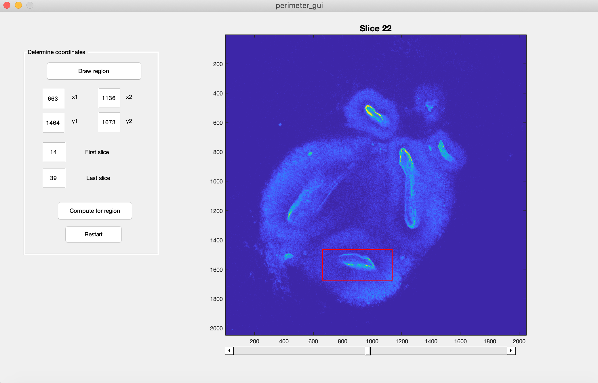
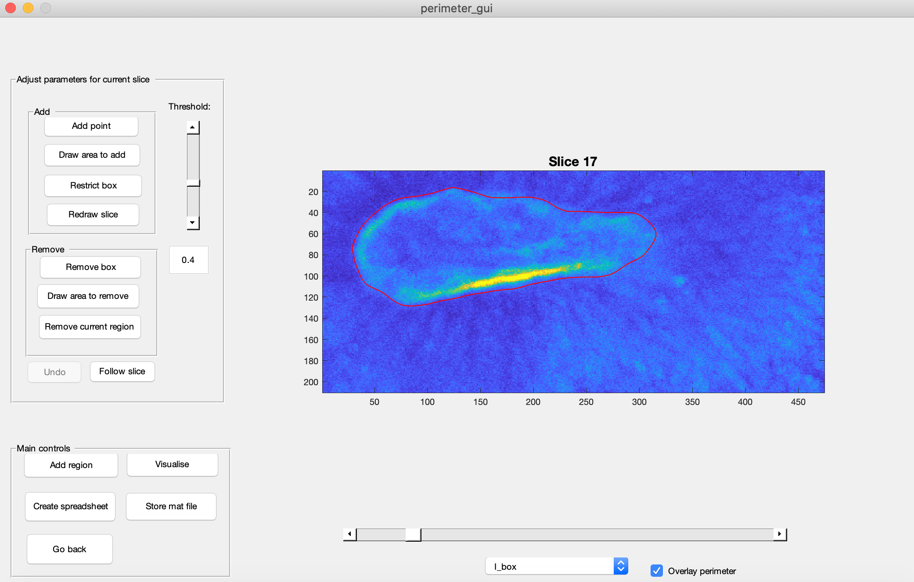
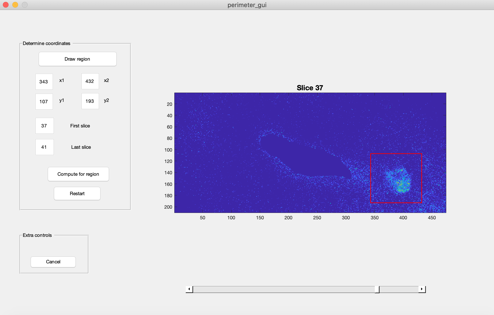
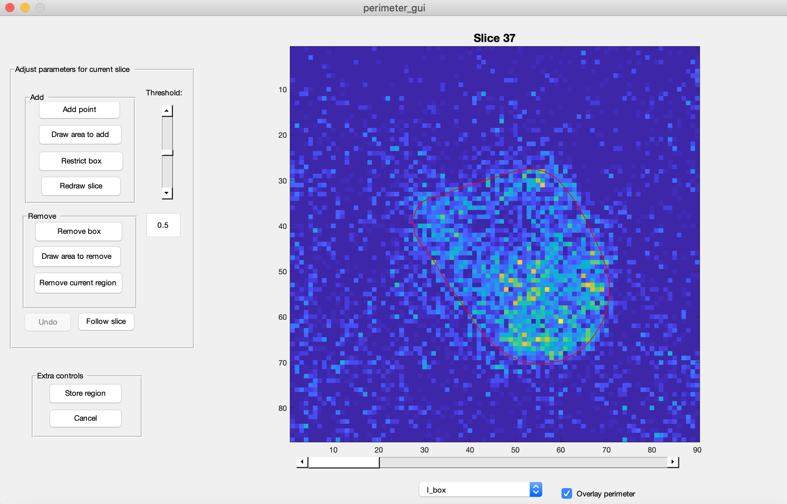
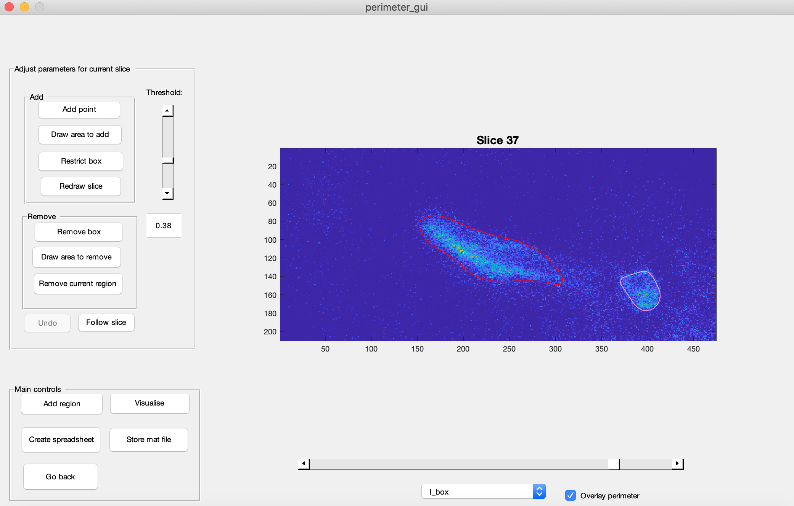
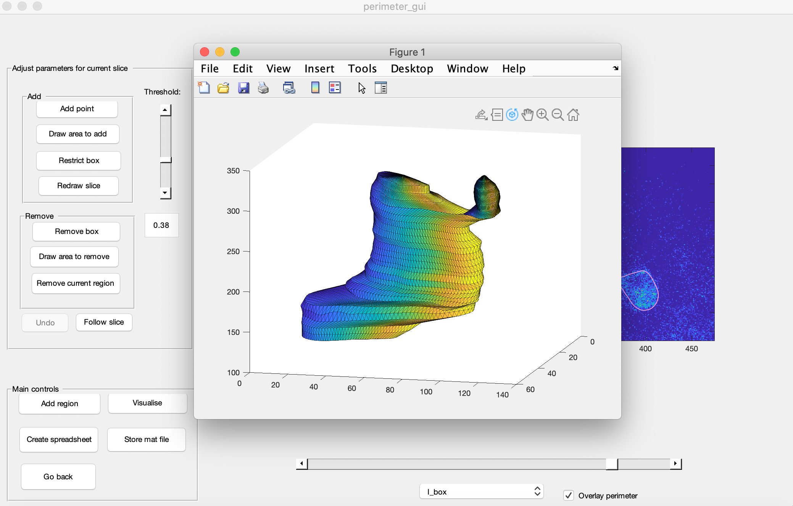

# Segmentation of 3D organoids

  

#### A MATLAB graphical user interface (GUI) for segmenting stacked 2D images of 3D organoid lumens. The segmentations are then combined to estimate the surface and surface area of the 3D structure.

  

The code is provided as supplementary material to the preprint [*An early cell shape transition drives evolutionary expansion of human forebrain](https://www.biorxiv.org/content/10.1101/2020.07.04.188078v1), Benito-Kwiecinski et al., 2020*.

  

## Requirements

* The MATLAB Image Processing toolbox.
* The GUI was developed on the macOS platform and might not be compatible with the Windows platform.
* The images to be segmented must have the extension *_.tif_* and be stored in a folder which the GUI can load.

  

## How to use programme

1. Add folders *_/functions/_* and *_/gui/_* to MATLAB search path, and run *_perimeter_gui.m_* to open the GUI.
2. Press **Choose folder** to load images.
3. Set a 3D region which contains the object to be segmented (see figure below). By using the **Draw region** and/or adjusting the *x*- and *y*-coordinates, and by setting the start and end slices (i.e. images), set a rectangular box.

4. Press **Compute for region** to perform segmentation. This takes you to a screen where you can manually fine-tune the segmentation for each slice (see figure below).

---
#### Adding an extra region
If the object branches into separate regions in some slices, steps 5-6 outline how to segment additional branches, which will then link to the main segmentation. If no branching occurs, skip to step 7.

5. Pressing **Add region** allows you to select a new subregion and to define the start and end slices.

6. Segmentation is done as usual for the extra region. To link to the main region, press **Store region**.

You will then see both segmentations outlined.

  ---
7. Once segmentation is done, press **Visualise** to view segmented object in 3D (see figure below), **Create spreadsheet** to save a *.cvs* file (see section on spreadsheets below), or **Store mat file** to store a *.mat* file with the main segmentation data.

 
  

## Spreadsheet format:

[Rows. Data]

  

1.  dx, dy, dz
2.  Total surface area
3.  Frame indices
4.  Perimeters of each frame for main region
5.  Perimeters of each frame for first, additional region
6.  Perimeters of each frame for second, additional region
7.  And so on...

  

  

  

## Contact

To get in touch, please email <erlend.s.riis@gmail.com> or raise an issue via the github issue tracker.
